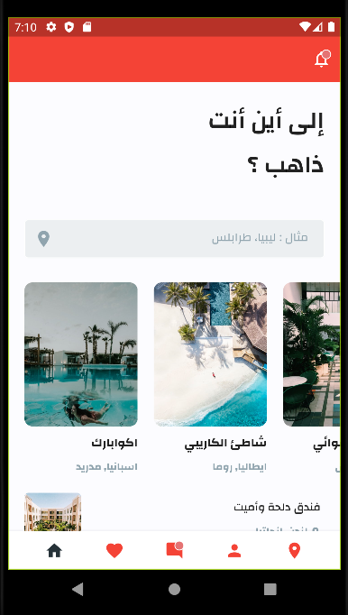
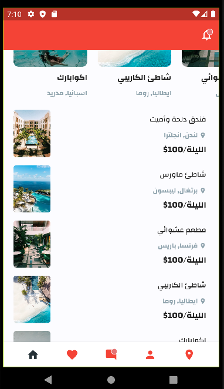
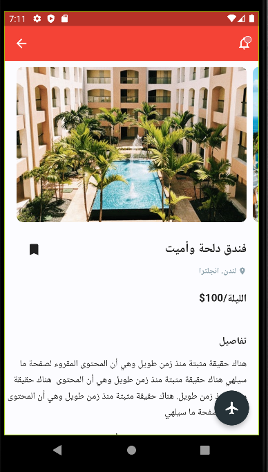

English | [简体中文](./README.zh-CN.md)
# 🛫Flutter Travel App Concept 

Flutter representation of a Travel App Concept i found in Uplabs. 
**It only consists of 2 screens.**

Images are from [Unsplash](https://unsplash.com)
## 📸 ScreenShots

| 1 |
|------|
|||

| 2 
|------|
|

## Toggle theme
The App's theme adapts to your device's theme

## Requirements
* Any Operating System (ie. MacOS X, Linux, Windows)
* Any IDE with Flutter SDK installed (ie. IntelliJ, Android Studio, VSCode etc)
* A little knowledge of Dart and Flutter
* A brain to think 🤓🤓

## Author(s)
**Olusegun Festus Babajide** 

## Getting Started

This project is a starting point for a Flutter application.

A few resources to get you started if this is your first Flutter project:

- [Lab: Write your first Flutter app](https://flutter.io/docs/get-started/codelab)
- [Cookbook: Useful Flutter samples](https://flutter.io/docs/cookbook)

For help getting started with Flutter, view our 
[online documentation](https://flutter.io/docs), which offers tutorials, 
samples, guidance on mobile development, and a full API reference.

## LICENCE
[WTFPL](http://www.wtfpl.net/about/)
